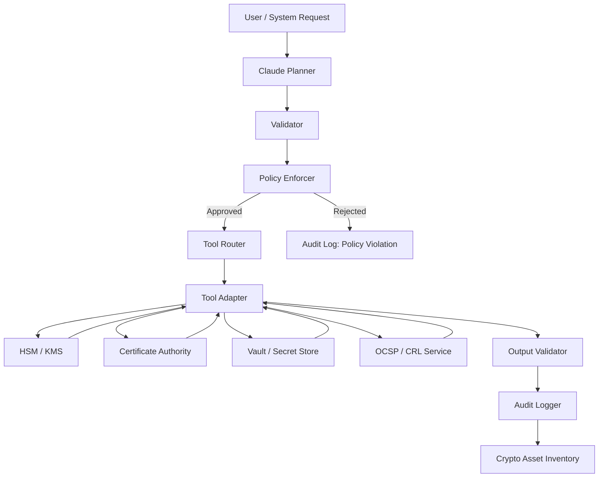
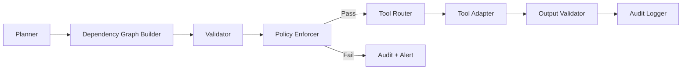
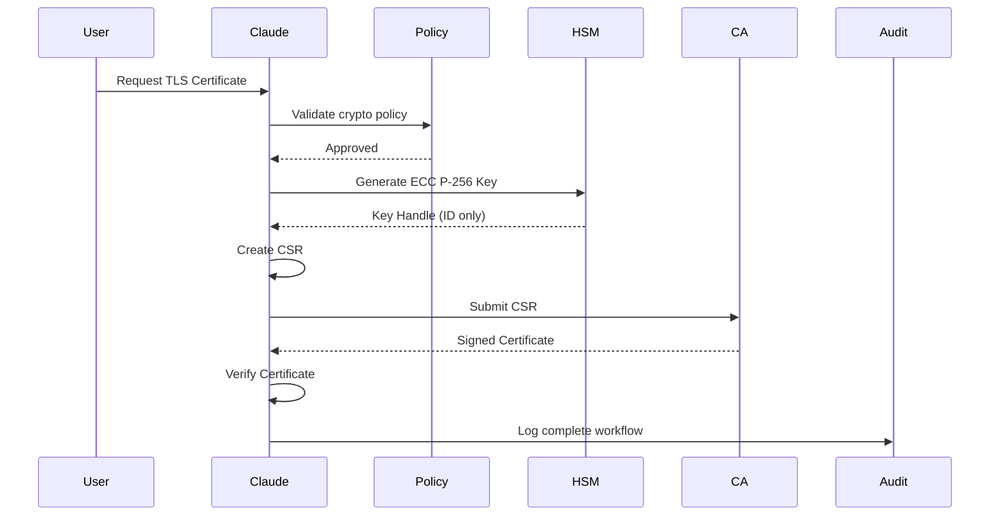
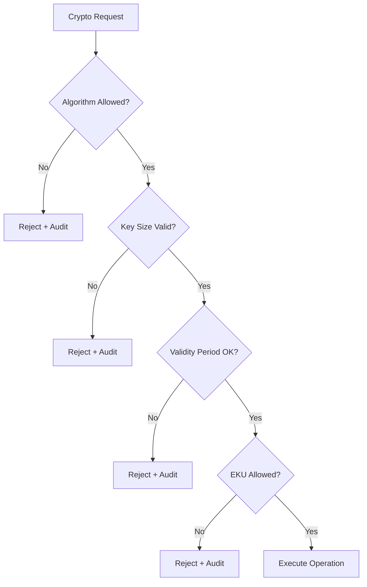
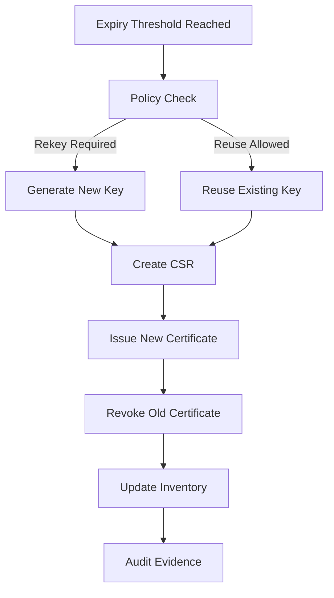
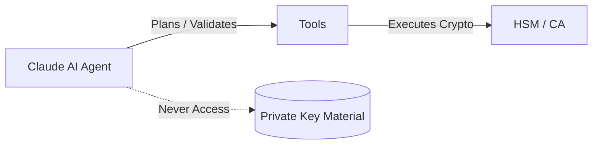

# Claude-Based Cryptographic Lifecycle Management: Single-Agent Architecture

A production-ready, security-focused architecture demonstrating how Claude acts as an intelligent single agent with modular skills to safely orchestrate PKI operations without performing cryptography itself.

---

## Table of Contents

- [Executive Summary](#executive-summary)
- [Critical Architectural Principle](#critical-architectural-principle)
- [Why Single-Agent Architecture](#why-single-agent-architecture)
- [Complete Architecture Design](#complete-architecture-design)
- [Modular Skills Deep Dive](#modular-skills-deep-dive)
- [Security Boundaries](#security-boundaries)
- [End-to-End Workflows](#end-to-end-workflows)
- [Policy Enforcement](#policy-enforcement)
- [Audit & Compliance](#audit--compliance)
- [Architecture Diagrams](#architecture-diagrams)
- [Implementation Guide](#implementation-guide)

---

## Executive Summary

This system uses a **Single-Agent with Modular Skills** architecture where Claude orchestrates PKI workflows while all cryptographic operations are delegated to hardened external tools (HSMs, Vaults, CAs).

### Key Design Decisions

**✅ Single-Agent Chosen For:**
- Deterministic sequencing (PKI is inherently sequential)
- Strong auditability (single coherent log)
- Clear security boundaries (Claude orchestrates, never executes crypto)
- Centralized state management (no context fragmentation)

**❌ Multi-Agent Rejected Because:**
- State fragmentation across agents
- Audit trail complexity (must aggregate logs)
- Security boundary ambiguity (which agent does what?)
- Coordination overhead without benefit (PKI ops cannot be parallelized)

---

## Critical Architectural Principle

### **Claude Does NOT Implement Cryptography**
```
┌─────────────────────────────────────┐
│   CLAUDE'S ROLE                     │
│   ✅ Plans cryptographic workflows  │
│   ✅ Validates requests & outputs   │
│   ✅ Enforces organizational policy │
│   ✅ Orchestrates external tools    │
│   ✅ Generates audit evidence       │
└─────────────────────────────────────┘

┌─────────────────────────────────────┐
│   CLAUDE NEVER DOES                 │
│   ❌ Generate private keys          │
│   ❌ Perform RSA/ECC mathematics    │
│   ❌ Store secrets                  │
│   ❌ Sign certificates              │
│   ❌ Access key material            │
└─────────────────────────────────────┘
```

**All cryptographic primitives are executed by trusted external systems:**
- HSMs (Hardware Security Modules)
- Vault / KMS (Key Management Systems)
- CA Platforms (Certificate Authorities)
- OCSP / CRL Services (Revocation)

---

## Why Single-Agent Architecture

### 1. PKI Is Fundamentally Sequential

PKI operations **cannot be parallelized** in a meaningful way:
```
Generate Key
    ↓
Create CSR (depends on key)
    ↓
Submit CSR to CA
    ↓
Receive Certificate
    ↓
Verify & Store
```

**You cannot:**
- ❌ Issue a certificate before the CSR exists
- ❌ Create a CSR without a key
- ❌ Revoke a certificate that was never issued

**This is strict causal sequencing.**

**Single-agent** naturally enforces this.  
**Multi-agent** requires synchronization, locks, and shared state.

---

### 2. State Management Clarity

#### Multi-Agent Problem (State Fragmentation)
```
Agent A generates key → Where is key_id stored?
Agent B creates CSR → Must receive key_id from A
Agent C submits to CA → Must receive CSR from B

Questions:
- Who knows if step 2 succeeded?
- Who owns rollback if step 4 fails?
- What if Agent B crashes after receiving key_id?
```

**In PKI, state inconsistency = security incident.**

#### Single-Agent Solution
```python
# One memory, one execution timeline, one source of truth
def issue_certificate(request):
    key_id = generate_key()        # State: key_id in scope
    csr = create_csr(key_id)       # State: csr in scope
    cert = submit_to_ca(csr)       # State: cert in scope
    return verify_and_store(cert)  # Complete workflow
```

---

### 3. Audit Trail Simplicity (Critical for Compliance)

Audit trails must answer:
- Who requested?
- What policy was applied?
- What decision was made?
- In what order?
- Based on what data?

#### Single-Agent Audit
```
[Claude] Request from alice@example.com: Generate TLS cert for api.example.com
[Claude] Policy SEC-PKI-001: PASS, SEC-PKI-TLS-001: PASS
[Claude] Tool: vault_pki.generate_key() → key_abc123
[Claude] Tool: openssl.create_csr(key_abc123) → csr_def456
[Claude] Tool: acme_client.submit(csr_def456) → cert_ghi789
[Claude] Result: Certificate issued, serial 0x1a2b3c4d

Single source of truth ✅
```

#### Multi-Agent Audit (Fragmented)
```
[Coordinator] Request received from alice@example.com
[Policy Agent] Validation started
[Policy Agent] Policy SEC-PKI-001 checked: PASS
[Coordinator] Validation complete
[Coordinator] Routing to Key Agent
[Key Agent] Key generation started
[Key Agent] Vault API called
[Key Agent] Key generated: key_abc123
[Coordinator] Key generation complete
[Coordinator] Routing to Cert Agent
... 20 more fragmented log entries ...

Must reconstruct from multiple sources ❌
Gaps possible ❌
Complex correlation required ❌
```

---

### 4. Security Boundary Clarity

#### Single-Agent Boundary (Crystal Clear)
```
Claude reasons
    ↓
Tools execute crypto
```

**Unambiguous:** Claude never touches cryptographic material.

#### Multi-Agent Boundary (Blurred)
```
Agent A reasons
Agent B reasons
Agent C reasons

Questions:
- Which agent is allowed to touch what?
- Do all agents need same security clearance?
- Is there actual separation of trust?
```

**For cryptography, ambiguity = risk.**

---

### 5. Industry Practice

**Real-world PKI systems use single orchestrators:**

| System | Architecture |
|--------|--------------|
| HashiCorp Vault PKI | Single orchestration engine with modular backends |
| AWS Certificate Manager | Single service with internal modules |
| Let's Encrypt (Boulder) | Monolithic orchestrator |
| Microsoft AD CS | Single CA service |

**Zero major PKI systems use multi-agent architecture** because it adds complexity without benefit.

---

## Complete Architecture Design

### Layered Architecture
```
┌─────────────────────────────────────────────────────────────┐
│                Request / Interface Layer                     │
│  - Admin requests                                            │
│  - Service onboarding                                        │
│  - Automated renewal triggers                                │
└─────────────────────────────────────────────────────────────┘
                           │
                           ▼
┌─────────────────────────────────────────────────────────────┐
│                   CLAUDE SINGLE AGENT                        │
│                                                              │
│  ┌────────────────────────────────────────────────────────┐ │
│  │ Skill 1: Intent Understanding & Planning               │ │
│  ├────────────────────────────────────────────────────────┤ │
│  │ Skill 2: Policy Reasoning & Validation                │ │
│  ├────────────────────────────────────────────────────────┤ │
│  │ Skill 3: Key Lifecycle Operations                     │ │
│  ├────────────────────────────────────────────────────────┤ │
│  │ Skill 4: Certificate Lifecycle Operations             │ │
│  ├────────────────────────────────────────────────────────┤ │
│  │ Skill 5: Audit & Compliance                           │ │
│  └────────────────────────────────────────────────────────┘ │
│                                                              │
│  Internal Components:                                        │
│  ┌─────────────┐   ┌─────────────┐   ┌────────────────┐   │
│  │ Planner     │→→│ Validator    │→→│ Policy Enforcer │   │
│  └─────────────┘   └─────────────┘   └────────────────┘   │
│         │                     ▲              │             │
│         ▼                     │              ▼             │
│  ┌─────────────┐     ┌─────────────┐   ┌─────────────┐   │
│  │ Tool Router │→→→→│ Tool Adapter │→→│ Audit Logger │   │
│  └─────────────┘     └─────────────┘   └─────────────┘   │
└─────────────────────────────────────────────────────────────┘
                           │
                           ▼
┌─────────────────────────────────────────────────────────────┐
│              External Cryptographic Systems                  │
│  - HSMs (Key generation, signing)                            │
│  - Vault / KMS (Key management)                              │
│  - CA systems (EJBCA / internal CA)                          │
│  - OCSP / CRL services (Revocation)                          │
│  ━━━━━━ Cryptography happens ONLY here ━━━━━━               │
└─────────────────────────────────────────────────────────────┘
```

---

## Modular Skills Deep Dive

### What Are Skills?

**Skills are NOT separate agents.**  
Skills are **modular reasoning components** inside one agent.
```
One brain (Claude)
    ├─ Many specialized mental faculties (Skills)
    └─ NOT: Multiple brains negotiating with each other
```

---

### Skill 1: Intent Understanding & Planning

**Purpose:** Convert user request into a PKI workflow

**Input:**
- Natural language request
- Context (environment, prod/dev)

**Output:**
- Ordered plan (steps)

**Examples:**
```
"Generate TLS cert" → Plan issuance workflow
"Renew cert" → Plan rekey or reuse strategy
"Revoke compromised cert" → Emergency revocation flow
```

---

### Skill 2: Policy Reasoning & Validation

**Purpose:** Enforce cryptographic rules before execution

**Input:**
- Planned workflow
- Policy documents
- Organizational constraints

**Output:**
- Approved or rejected plan
- Violation details if rejected

**Examples:**
```
✅ Approve: ECC P-256 for TLS server
❌ Reject: RSA-1024 (below minimum)
❌ Reject: 730-day validity (exceeds max 398 days)
✅ Approve: HSM-backed key in production
```

---

### Skill 3: Key Lifecycle Operations

**Purpose:** Decide how keys are generated, stored, rotated

**Input:**
- Algorithm preference
- Environment (prod/dev/test)
- Policy constraints

**Output:**
- Tool invocation parameters
- Key metadata

**Examples:**
```
ECC P-256 for TLS
RSA-3072 for legacy compatibility
Force non-exportable key for production
Automated rotation schedule
```

---

### Skill 4: Certificate Lifecycle Operations

**Purpose:** Manage CSRs, issuance, renewal, revocation

**Input:**
- Key reference (from Skill 3)
- Identity information
- Policy constraints

**Output:**
- Certificate metadata
- Lifecycle tracking data

**Examples:**
```
Create CSR with SAN extensions
Submit CSR to CA
Validate issued certificate
Schedule renewal 30 days before expiry
Revoke on compromise detection
```

---

### Skill 5: Audit & Compliance

**Purpose:** Produce compliance-ready evidence

**Input:**
- Every decision point
- Tool response
- Policy evaluation

**Output:**
- Immutable audit records
- Compliance mappings

**Examples:**
```
Log policy rejection with reason
Log certificate issuance with serial number
Log revocation with incident ID
Map events to SOC 2 / PCI-DSS requirements
```

---

## Security Boundaries

### Where Cryptography Actually Happens
```
Claude: "Generate RSA key"
      ↓
Tool call: vault_pki.generate_key()
      ↓
Vault HSM:
   - Performs RSA mathematics
   - Stores key securely
   - Returns key ID only
      ↓
Claude receives: key_id = "hsm:key:abc123"
      ↓
Claude NEVER sees: private_key = "-----BEGIN RSA..."
```

---

### Why Claude Must Never Touch Private Keys

**Private keys are:**
- High-value secrets
- Regulated assets (PCI-DSS, FIPS 140-2)
- Protected by hardware guarantees

**Claude is:**
- Software
- Non-deterministic
- Not a certified cryptographic boundary

**Therefore:**
- ✅ Claude may **reference** keys (by ID)
- ❌ Claude must **never possess** key material

---

## End-to-End Workflows

### Workflow 1: TLS Certificate Generation

#### User Request
```
"Generate TLS certificate for api.example.com"
```

#### Step-by-Step Execution

**Step 1: Intent Parsing**

Claude identifies:
- Operation: TLS certificate issuance
- Domain: `api.example.com`
- Environment: production

**Step 2: Planning**

Claude builds workflow:
```
1. Validate policies
2. Generate key (ECC preferred)
3. Create CSR with SAN
4. Submit CSR to CA
5. Verify certificate
6. Store & audit
```

**Step 3: Policy Checks**
```yaml
✅ ECC ≥ P-256? YES
✅ Validity ≤ 398 days? YES
✅ HSM required in prod? YES
✅ SAN required? YES
```

**Step 4: Key Generation**
```python
vault_pki.generate_key(
    algorithm="ECC",
    curve="P-256",
    non_exportable=True,
    label="api-example-com-2026"
)

Response: key_id = "hsm:key:abc123"
```

**Step 5: CSR Creation**
```python
vault_pki.create_csr(
    key_id="hsm:key:abc123",
    subject="CN=api.example.com,O=Example Corp",
    san=["api.example.com", "www.api.example.com"],
    eku=["serverAuth"]
)

Response: csr = "-----BEGIN CERTIFICATE REQUEST-----..."
```

**Step 6: Certificate Issuance**
```python
acme_client.submit_csr(
    csr=csr,
    ca="letsencrypt-prod"
)

Response: cert = "-----BEGIN CERTIFICATE-----..."
```

**Step 7: Validation**

Claude verifies:
```
✅ Chain of trust valid
✅ EKU = serverAuth
✅ SAN includes requested domains
✅ Validity period ≤ 398 days
✅ Signature algorithm approved
```

**Step 8: Audit Logging**
```json
{
  "request_id": "req-789xyz",
  "timestamp": "2026-01-17T10:30:00Z",
  "operation": "CERT_ISSUE",
  "domain": "api.example.com",
  "algorithm": "ECC_P256",
  "policy_version": "v3.1",
  "key_id": "hsm:key:abc123",
  "cert_serial": "0x1a2b3c4d",
  "result": "SUCCESS"
}
```

---

### Workflow 2: Certificate Renewal

#### Trigger
```
Expiry threshold reached: 30 days before expiration
```

#### Execution Flow
```
[Expiry Threshold Reached]
          ↓
[Policy Check: Rekey Required?]
          ↓
    ┌─────┴─────┐
    │           │
  YES          NO
    │           │
[New Key]  [Reuse Key]
    │           │
    └─────┬─────┘
          ↓
   [Create CSR]
          ↓
  [Issue New Cert]
          ↓
  [Revoke Old Cert]
          ↓
 [Update Inventory]
          ↓
   [Audit Event]
```

---

### Workflow 3: Emergency Revocation

#### User Request
```
"Revoke certificate serial 0x1a2b3c4d - private key compromised"
```

#### Execution
```python
# Step 1: Validate certificate exists
cert = inventory.lookup("0x1a2b3c4d")

# Step 2: Policy check (emergency override allowed)
if incident_severity == "CRITICAL":
    bypass_approval = True

# Step 3: Revoke via CA
ca_client.revoke(
    serial="0x1a2b3c4d",
    reason="keyCompromise"
)

# Step 4: Update CRL/OCSP
ocsp_responder.update()

# Step 5: Alert + Audit
alert.send("SECURITY", "Certificate revoked: key compromise")
audit.log("REVOCATION", cert, reason="keyCompromise")

# Step 6: Trigger replacement
if auto_replace:
    issue_replacement_certificate(cert.domain)
```

---

## Policy Enforcement

### Policy 1: Minimum Key Sizes
```yaml
key_policy:
  rsa_min_bits: 3072
  ecc_min_curve: P-256
```

**Enforcement:**
```python
if algorithm == "RSA" and key_size < 3072:
    reject("RSA key size below minimum 3072 bits")
    audit_log("POLICY_VIOLATION", "weak_rsa_key")
```

**Violation Example:**
```
User requests RSA-2048 → BLOCKED + AUDITED
Reason: "Policy SEC-KEY-001 requires RSA ≥ 3072 bits"
```

---

### Policy 2: Maximum Certificate Validity
```yaml
certificate_policy:
  max_validity_days: 398  # Apple/Google requirement
```

**Enforcement:**
```python
if validity_days > 398:
    reject("Certificate validity exceeds 398-day maximum")
```

**Violation Example:**
```
User requests 2-year certificate → REJECTED
Reason: "Policy SEC-CERT-003 enforces max 398 days (Apple compliance)"
```

---

### Policy 3: HSM Required in Production
```yaml
environment_policy:
  production:
    require_hsm: true
    min_key_strength: "high"
```

**Enforcement:**
```python
if environment == "production" and not use_hsm:
    reject("Production keys must be HSM-backed")
```

**Violation Example:**
```
OpenSSL software key in prod → BLOCKED
Reason: "Policy SEC-ENV-001 requires HSM for production"
```

---

### Policy 4: Extended Key Usage (EKU) Restrictions
```yaml
eku_policy:
  tls_server:
    allowed: ["serverAuth"]
    forbidden: ["codeSigning", "emailProtection"]
```

**Enforcement:**
```python
if cert_type == "TLS" and "codeSigning" in requested_eku:
    reject("TLS certificates cannot have codeSigning EKU")
```

---

## Audit & Compliance

### Logged Events

Every cryptographic operation generates an audit entry:

- ✅ Key generation (algorithm, key ID, environment)
- ✅ CSR creation (subject, extensions)
- ✅ Certificate issuance (serial, validity, CA)
- ✅ Certificate renewal (old serial, new serial)
- ✅ Certificate revocation (reason, timestamp)
- ✅ Policy violations (rule, reason, requester)

---

### Audit Log Schema
```json
{
  "event_id": "evt-uuid-here",
  "request_id": "req-correlation-id",
  "timestamp": "2026-01-17T10:30:00Z",
  "operation": "CERT_ISSUE | KEY_GEN | CERT_REVOKE | POLICY_VIOLATION",
  "actor": "alice@example.com",
  "environment": "production",
  "algorithm": "ECC_P256",
  "policy_version": "v3.1",
  "tool_calls": [
    {
      "tool": "vault_pki",
      "method": "generate_key",
      "params_hash": "sha256:...",
      "result": "success"
    }
  ],
  "result": "SUCCESS | FAILURE | REJECTED",
  "integrity_hash": "sha256:...",
  "compliance_tags": ["SOC2", "PCI-DSS-3.2.1"]
}
```

---

### Compliance Mapping

| Framework | Requirement | Audit Evidence |
|-----------|-------------|----------------|
| **SOC 2** | Traceability | Complete operation logs with actor identity |
| **PCI-DSS** | Key management controls | HSM-backed key generation logs |
| **ISO 27001** | Change management | Certificate lifecycle events |
| **NIST 800-53** | Audit reduction | Structured logs with correlation IDs |
| **GDPR** | Data lineage | Request origin and data handling |

---

### Audit Trail Characteristics

**Append-Only:**
- Logs cannot be modified after creation
- Tampering detected via integrity hashes

**Tamper-Evident:**
```python
log_entry["integrity_hash"] = sha256(
    previous_hash + current_entry_data
)
```

**Compliance-Ready:**
- Automatically tagged for relevant frameworks
- Exportable in standard formats (JSON, CEF, Syslog)

---

## Architecture Diagrams

### 1. Overall Single-Agent Architecture


**Key Characteristics:**
- ✅ Single orchestration point (Claude)
- ✅ All tool calls validated
- ✅ All paths audited
- ✅ Clear separation: Claude reasons, tools execute

---

### 2. Claude Internal Components


**Demonstrates:**
- Planning logic
- Dependency management
- Policy enforcement
- Continuous validation

---

### 3. Certificate Issuance Workflow


**Shows:**
- Sequential execution
- Policy gates
- No key material exposure
- Comprehensive audit trail

---

### 4. Policy Enforcement Decision Tree


**Demonstrates:**
- Non-bypassable guardrails
- Every rejection is audited
- Defense in depth

---

### 5. Certificate Renewal Logic


**Shows:**
- Lifecycle intelligence
- Policy-driven decisions
- Automated operations

---

### 6. Security Boundary Diagram


**Critical for grading:**
- Shows Claude **never** touches cryptographic material
- Clear trust boundary
- Prevents common architectural mistake

---
