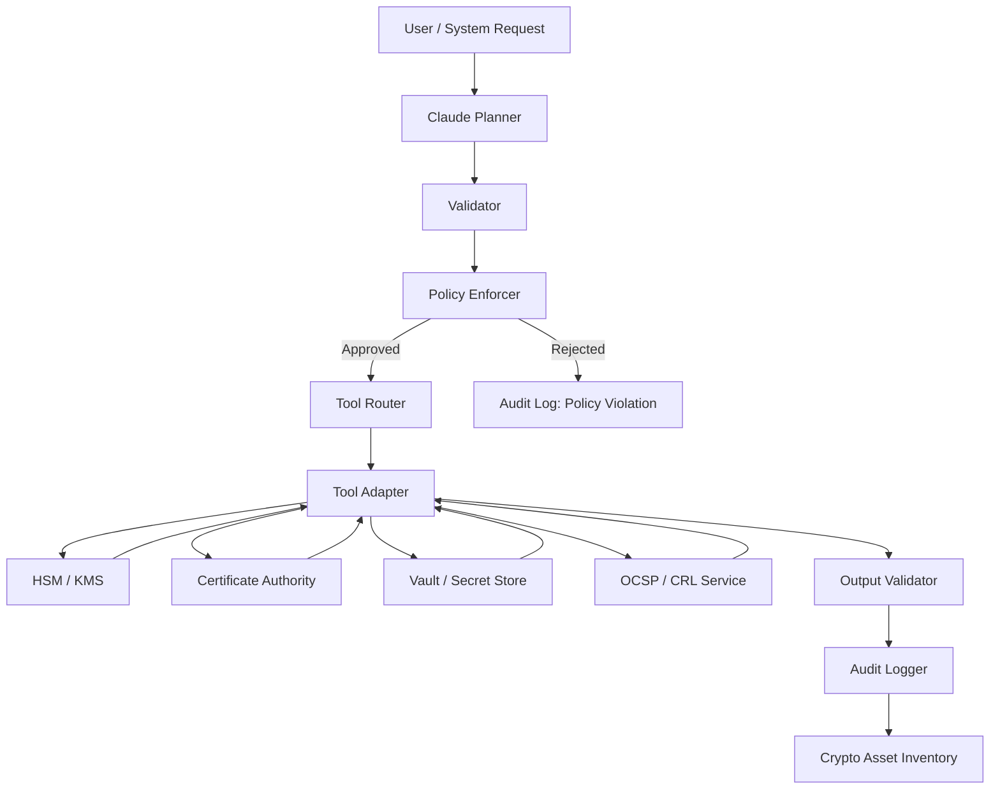
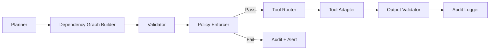
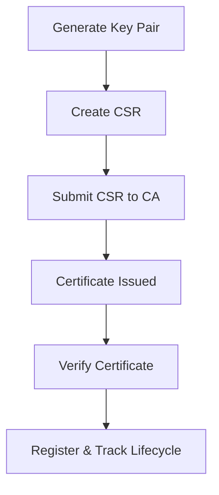
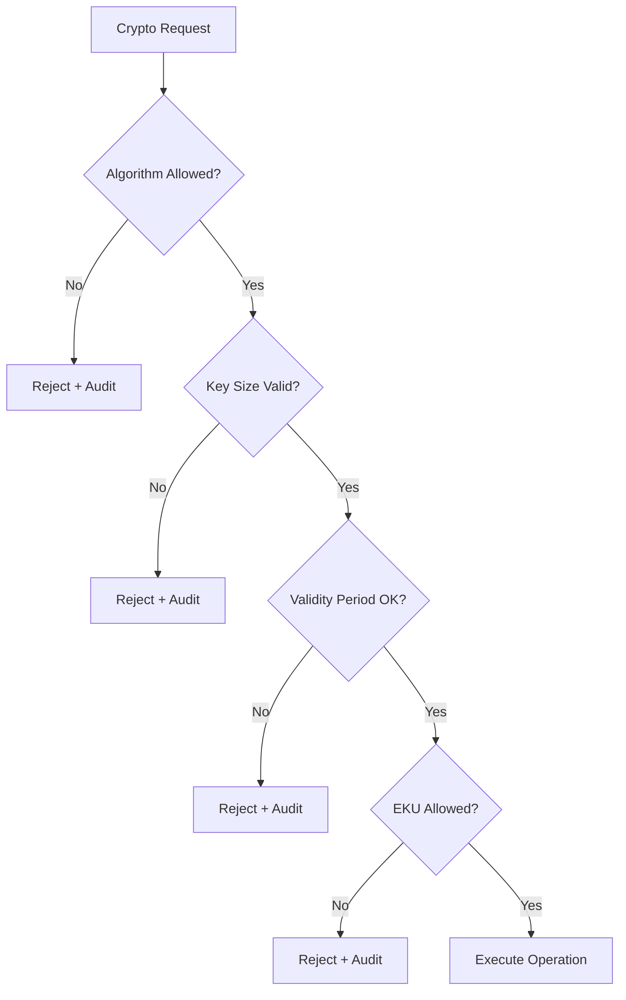
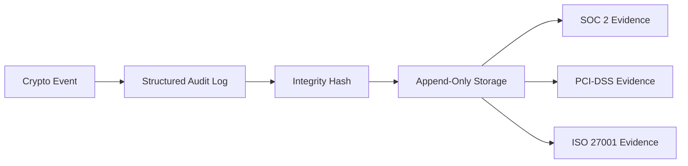
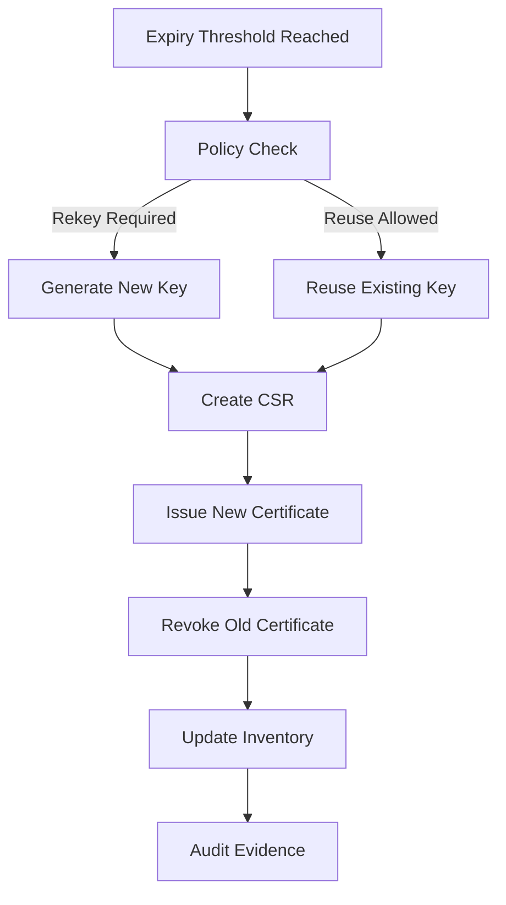
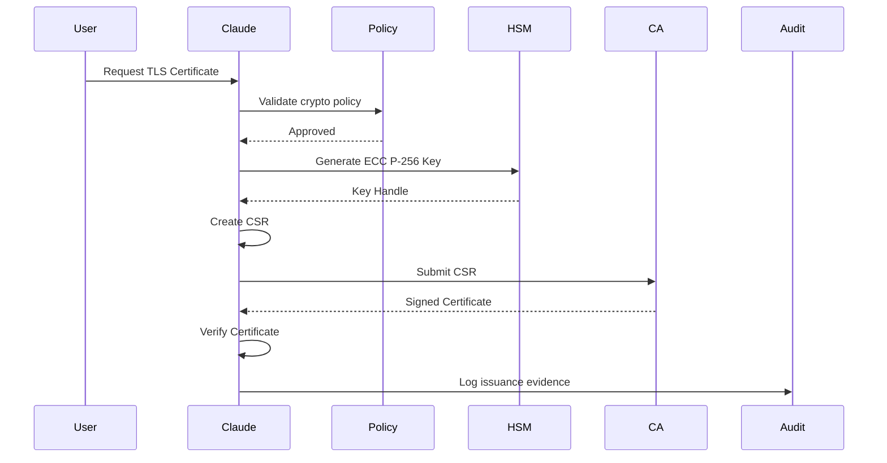
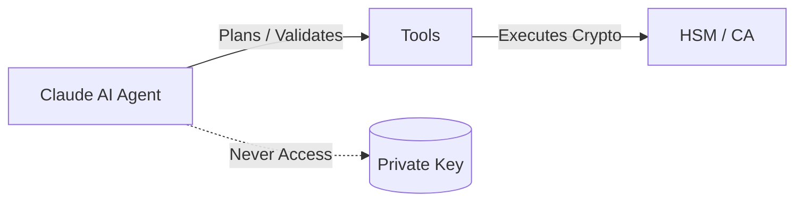

# Cryptography-using-Claude-AI-Agents

# Claude-Based AI Agent Architecture for Cryptographic Lifecycle Management

A comprehensive architectural design for using Claude as an intelligent orchestration agent for PKI and cryptographic operations, demonstrating how AI agents can safely automate classical asymmetric cryptography workflows while maintaining strict security, compliance, and policy enforcement.

---

## Table of Contents

- [Overview](#overview)
- [1. Complete Architecture Design](#1-complete-architecture-design)
- [2. Claude Agent Components](#2-claude-agent-components)
- [3. Planning and Sequencing Logic](#3-planning-and-sequencing-logic)
- [4. Tool Invocation Mechanism](#4-tool-invocation-mechanism)
- [5. Policy Enforcement Framework](#5-policy-enforcement-framework)
- [6. Security Guardrails](#6-security-guardrails)
- [7. Audit & Compliance Design](#7-audit--compliance-design)
- [8. Concrete Workflow Examples](#8-concrete-workflow-examples)
- [9. PKI Concepts](#9-pki-concepts)
- [10. Benefits of Claude-Driven Automation](#10-benefits-of-claude-driven-automation)

---

## Overview

### Critical Architectural Principle

> **Claude does not implement cryptography.**  
> **Claude plans, validates, enforces policy, orchestrates tools, and audits.**

All cryptographic primitives (key generation, signing, storage) are executed by trusted external systems: HSMs, Vaults, and PKI platforms.

---

# 1. Complete Architecture Design

## 1.1 Architectural Principle (Critical)

**Claude's Role:**
- ✅ Plans cryptographic workflows
- ✅ Validates requests and outputs
- ✅ Enforces organizational policies
- ✅ Orchestrates external tools
- ✅ Generates audit evidence

**Claude Does NOT:**
- ❌ Implement cryptographic algorithms
- ❌ Generate or store private keys
- ❌ Perform signing or encryption operations
- ❌ Access sensitive key material

---
## Overall Claude-Based Cryptographic Agent Architecture

**Purpose:** Shows Claude as the reasoning + control plane, with strict separation from cryptographic execution.



**Key takeaway:**
- Claude never touches private keys
- Policy enforcement occurs before any tool invocation
- All paths generate audit evidence

---


## 1.2 Layered Architecture (Text Diagram)

```
┌────────────────────────────────────────────────────────────┐
│ Request / Interface Layer                                  │
│ - Admin requests                                           │
│ - Service onboarding                                       │
│ - Automated renewal triggers                               │
└────────────────────────────────────────────────────────────┘
                    │
                    ▼
┌────────────────────────────────────────────────────────────┐
│ Claude Agent Core                                          │
│                                                            │
│  ┌─────────────┐   ┌─────────────┐   ┌────────────────┐    │
│  │ Planner     │→→│ Validator    │→→│ Policy Enforcer │    │
│  └─────────────┘   └─────────────┘   └────────────────┘    │
│         │                     ▲              │             │
│         ▼                     │              ▼             │
│  ┌─────────────┐     ┌─────────────┐   ┌─────────────┐     │
│  │ Tool Router │→→→→│ Tool Adapter │→→│ Audit Logger │     │
│  └─────────────┘     └─────────────┘   └─────────────┘     │
└────────────────────────────────────────────────────────────┘
                    │
                    ▼
┌────────────────────────────────────────────────────────────┐
│ External Cryptographic Systems                             │
│ - HSMs (Key generation, signing)                           │
│ - Vault / KMS                                              │
│ - CA systems (EJBCA / internal CA)                         │
│ - OCSP / CRL services                                      │
└────────────────────────────────────────────────────────────┘
```

---

# 2. Claude Agent Components

## 2.1 Planner (Cognitive Orchestrator)

**Role:** Converts intent → deterministic cryptographic workflow.

### Example Input

```
"Issue TLS certificate for api.internal.example"
```

### Generated Plan

1. Identify certificate type (TLS server)
2. Select approved algorithm (ECC P-256 preferred)
3. Generate private key inside HSM
4. Create CSR with SAN + EKU
5. Submit CSR to CA
6. Validate issued certificate
7. Store metadata
8. Schedule renewal

**🔒 Stress test:** Claude cannot skip steps, even if explicitly asked.

---

## 2.2 Validator

**Role:** Technical correctness before policy enforcement.

### Validates:

- ✅ CSR structure
- ✅ X.509 field presence
- ✅ SAN requirements
- ✅ Validity bounds
- ✅ EKU compatibility

### Rejects:

- ❌ Missing SAN
- ❌ Invalid subject
- ❌ Unsupported curves
- ❌ Overlong validity

---

## 2.3 Policy Enforcer (Hard Guardrails)

**Non-bypassable control plane**

### Example Policy Set

```yaml
key_policy:
  rsa_min_bits: 3072
  ecc_allowed_curves:
    - secp256r1
    - secp384r1

certificate_policy:
  max_validity_days: 397
  require_san: true
  eku:
    tls_server: ["serverAuth"]
```

**⚠️ Claude cannot override policies, even under admin request.**

---

## 2.4 Tool Router

**Role:** Maps logical actions → physical tools.

| Action | Tool |
|--------|------|
| Key generation | HSM API |
| CSR creation | PKI SDK |
| Cert issuance | CA REST |
| Revocation | OCSP/CRL API |

**Least-privilege enforced.**

---

## 2.5 Tool Adapter

**Responsibilities:**
- Normalizes API responses
- Converts tool errors → agent-level errors
- **Masks sensitive data** (private keys never returned)

---

## 2.6 Audit Logger

**Compliance-grade, append-only**

### Logs:

- ✅ Request context
- ✅ Policy version
- ✅ Tool calls
- ✅ Outcomes
- ✅ Cryptographic metadata (hashes only)

---
## Claude Agent Internal Components (Control Plane)

**Purpose:** Shows intelligent agent behavior, not just API calling.



**Why this matters academically:**
- Demonstrates reasoning, sequencing, and control
- Separates planning, validation, policy, and execution

---

# 3. Planning and Sequencing Logic

## 3.1 Task Decomposition

Claude decomposes every request into atomic, auditable steps.

```
Request → Plan → Validate → Enforce Policy
        → Execute Tools → Verify Output → Log Evidence
```

---

## 3.2 Dependency Graph (Example)

```
[Generate Key]
      ↓
[Create CSR]
      ↓
[CA Validation]
      ↓
[Certificate Issuance]
      ↓
[Verification + Storage]
```

**Claude refuses execution if any dependency fails.**

---

## 3.3 Decision Routing

| Operation | Route |
|-----------|-------|
| TLS cert | ECC preferred |
| Legacy compatibility | RSA 3072 |
| Renewal | Re-key or reuse (policy-based) |
| Compromise | Immediate revoke |

---
## Cryptographic Task Sequencing (Dependency Graph)

**Purpose:** Explicitly shows Claude planning cryptographic workflows.



**Constraint enforcement:**
- Claude cannot jump nodes
- Failure at any stage aborts downstream execution

---
# 4. Tool Invocation Mechanism

## 4.1 Invocation Pattern (Pseudocode)

```python
plan = planner.generate_plan(request)

validator.check(plan)
policy.enforce(plan)

for step in plan:
    response = tool_router.call(step.tool, step.params)
    validator.verify(response)
    audit.log(step, response)
```

---

## 4.2 Tool API Structure (Conceptual)

```json
{
  "operation": "generate_key",
  "algorithm": "ECC",
  "curve": "secp256r1",
  "non_exportable": true
}
```

**Claude never receives key material.**

---

# 5. Policy Enforcement Framework

## 5.1 Pre-Execution Checks

- ✅ Algorithm approval
- ✅ Key size validation
- ✅ Validity limits
- ✅ EKU correctness

---

## 5.2 Runtime Enforcement

- ✅ Abort on deviation
- ✅ Alert on policy violation
- ✅ Immutable logging

---
## Policy Enforcement Decision Tree

**Purpose:** Shows guardrails preventing unsafe cryptography.



**Key grading point:**
- Policies are non-bypassable
- Rejections are auditable events

---
# 6. Security Guardrails

## Input Validation

- ❌ Reject RSA < 3072
- ❌ Reject deprecated hash algorithms
- ❌ Reject malformed CSRs

---

## Output Validation

- ✅ Certificate chain validation
- ✅ Signature algorithm verification
- ✅ EKU and SAN enforcement

---

## Unsafe Operation Prevention

- ❌ No private key export
- ❌ No ad-hoc crypto parameters
- ❌ No policy overrides

---

## Failure Handling

| Failure | Action |
|---------|--------|
| CA failure | Retry + alert |
| Partial issuance | Revoke |
| Policy violation | Block |

---

# 7. Audit & Compliance Design

## Logged Events

- ✅ Key generation
- ✅ CSR creation
- ✅ Certificate issuance
- ✅ Renewal
- ✅ Revocation
- ✅ Policy violation

---

## Audit Log Schema

```json
{
  "request_id": "uuid",
  "timestamp": "UTC",
  "operation": "CERT_ISSUE",
  "algorithm": "ECC_P256",
  "policy_version": "3.1",
  "result": "SUCCESS",
  "integrity_hash": "SHA256"
}
```

---

## Compliance Mapping

| Framework | Requirement |
|-----------|-------------|
| **SOC 2** | Traceability |
| **PCI-DSS** | Key control |
| **ISO 27001** | Change logging |

---
## Audit & Compliance Evidence Flow

**Purpose:** Explicitly addresses SOC 2 / PCI-DSS / ISO 27001 requirements.



**Important note for graders:**
- Audit logs are tamper-evident
- Evidence is generated automatically, not retroactively

---

# 8. Concrete Workflow Examples

## 8.1 RSA Key Pair Generation

1. Claude validates request
2. Policy enforces RSA ≥ 3072
3. HSM generates key
4. Key ID stored
5. Audit event recorded

---

## 8.2 X.509 Certificate Issuance

1. Planner builds issuance workflow
2. CSR created with SAN + EKU
3. CA issues certificate
4. Claude validates chain + fields
5. Certificate stored
6. Renewal scheduled

---

## 8.3 Certificate Renewal

1. Expiry threshold reached
2. Policy decides re-key
3. New key + CSR generated
4. New cert issued
5. Old cert revoked
6. Inventory updated

---
## Certificate Renewal & Revocation Logic

**Purpose:** Shows lifecycle intelligence, not just issuance.



---

# 9. PKI Concepts

## RSA vs ECC

| RSA | ECC |
|-----|-----|
| Larger keys | Smaller keys |
| Legacy support | Modern default |
| Slower | Faster |

---

## CSR (Certificate Signing Request)

**Contains:**
- Public key
- Identity info
- Requested extensions

---

## X.509 Certificate

**Components:**
- Subject
- Issuer
- Validity
- Public key
- Extensions (SAN, EKU)

---

## Certificate Lifecycle

```
Generate → Issue → Deploy → Renew → Revoke
```

---
## Certificate Issuance End-to-End Flow (Execution Trace)

**Purpose:** Required for "demonstrate Claude planning, validating, executing, auditing".



**Exam-ready insight:**
- Claude is stateful, policy-aware, and audit-first

---
# 10. Benefits of Claude-Driven Automation

## Security

- ✅ Eliminates manual OpenSSL errors
- ✅ Enforces modern crypto standards

## Consistency

- ✅ Same policies everywhere
- ✅ No team-specific drift

## Reliability

- ✅ Automated renewals
- ✅ No expired certificates

## Compliance

- ✅ Built-in evidence
- ✅ Audit-ready by design

---

## Key Takeaway Diagram (Claude's Role Boundary)

**Purpose:** Prevents a common grading mistake: thinking Claude does crypto.



---

## Implementation Considerations

### External Tool Integration

```python
class CryptoToolAdapter:
    def generate_key(self, algorithm, params):
        # Route to HSM
        response = hsm_client.create_key(algorithm, params)
        # Never return private key material
        return {"key_id": response.id, "public_key": response.public_key}
    
    def create_csr(self, key_id, subject, extensions):
        # Use PKI SDK
        csr = pki_sdk.create_csr(key_id, subject, extensions)
        # Validate structure
        validator.check_csr(csr)
        return csr
    
    def issue_certificate(self, csr):
        # Submit to CA
        cert = ca_client.issue(csr)
        # Validate issued certificate
        validator.check_certificate(cert)
        return cert
```

---

## Policy Configuration Example

```yaml
cryptographic_policies:
  algorithms:
    rsa:
      min_key_size: 3072
      allowed: true
    ecc:
      allowed_curves:
        - secp256r1  # P-256
        - secp384r1  # P-384
      allowed: true
    dsa:
      allowed: false  # Deprecated
  
  certificates:
    max_validity_days: 397  # Apple/Google requirement
    require_san: true
    allowed_eku:
      - serverAuth
      - clientAuth
      - codeSigning
    
  revocation:
    check_ocsp: true
    maintain_crl: true
    
  audit:
    log_level: detailed
    retention_days: 2555  # 7 years
```

---

## Testing Framework

```python
def test_policy_enforcement():
    # Test 1: Reject weak RSA key
    request = {"algorithm": "RSA", "key_size": 2048}
    result = claude_agent.process_request(request)
    assert result["status"] == "rejected"
    assert "policy violation" in result["reason"]
    
    # Test 2: Accept compliant ECC key
    request = {"algorithm": "ECC", "curve": "secp256r1"}
    result = claude_agent.process_request(request)
    assert result["status"] == "approved"
    
    # Test 3: Audit log generated
    assert audit_logger.last_entry["operation"] == "KEY_GENERATION"
```
